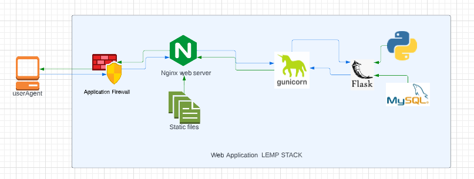
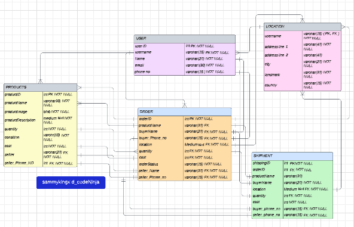

# Cheap Goods
CheapGoods is a p2p platform that enables local products at an affordable rate. We founded CheapGoods with one goal in mind: providing high-quality carefully developed products, made for everyone, so Every items counts.

## Web Infrastructure

- nginx web server
- flask web framework
- gunicorn wsgi server

## db Schema

## application file structure

```bash
.
├── app_package
│   ├── __init__.py
│   ├── routes
│   │   ├── index.py
│   ├── static
|   |   ├── styles
|   |   ├── scripts
│   └── templates
├── main.py
```

AHOUTRS
Aitebiremen Okojie <https://github.com/tebiremen>
SAmuel Iyebhora <https://github.com/sammykingx>
Chinedu Ugokwe <https://github.com/>
